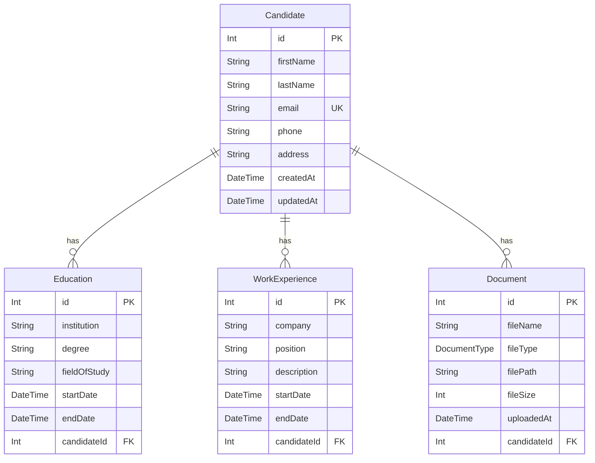

# Data Model Documentation

This document describes the data model for the LTI (Learning Tracking Initiative) application, including entity descriptions, field definitions, relationships, and an entity-relationship diagram.

## Model Descriptions

### 1. Candidate

Represents a job candidate who can apply for positions within the system. Serves as the aggregate root for related entities (Education, WorkExperience, Document).

**Fields:**

| Field       | Type     | Constraints                     | Description                 |
| ----------- | -------- | ------------------------------- | --------------------------- |
| `id`        | Int      | PK, Auto-increment              | Unique identifier           |
| `firstName` | String   | Required, Max 100 chars         | Candidate's first name      |
| `lastName`  | String   | Required, Max 100 chars         | Candidate's last name       |
| `email`     | String   | Required, Unique, Max 255 chars | Contact email address       |
| `phone`     | String   | Optional, Max 20 chars          | Phone number (E.164 format) |
| `address`   | String   | Optional, Max 500 chars         | Physical address            |
| `createdAt` | DateTime | Auto-generated                  | Record creation timestamp   |
| `updatedAt` | DateTime | Auto-updated                    | Last modification timestamp |

**Relationships:**

- One-to-many with Education (cascade delete)
- One-to-many with WorkExperience (cascade delete)
- One-to-many with Document (cascade delete)

**Validation Rules:**

- Email must be unique across all candidates
- firstName and lastName are required fields

---

### 2. Education

Stores educational background information for a candidate.

**Fields:**

| Field          | Type     | Constraints             | Description                          |
| -------------- | -------- | ----------------------- | ------------------------------------ |
| `id`           | Int      | PK, Auto-increment      | Unique identifier                    |
| `institution`  | String   | Required, Max 200 chars | Educational institution name         |
| `degree`       | String   | Required, Max 200 chars | Degree obtained or pursued           |
| `fieldOfStudy` | String   | Optional, Max 200 chars | Area of study/major                  |
| `startDate`    | DateTime | Required                | Education start date                 |
| `endDate`      | DateTime | Optional                | Education end date (null if ongoing) |
| `candidateId`  | Int      | FK, Required, Indexed   | Reference to parent Candidate        |

**Relationships:**

- Many-to-one with Candidate

**Validation Rules:**

- candidateId must reference an existing Candidate
- endDate, if provided, must be after startDate

---

### 3. WorkExperience

Stores work history information for a candidate.

**Fields:**

| Field         | Type     | Constraints             | Description                            |
| ------------- | -------- | ----------------------- | -------------------------------------- |
| `id`          | Int      | PK, Auto-increment      | Unique identifier                      |
| `company`     | String   | Required, Max 200 chars | Company/organization name              |
| `position`    | String   | Required, Max 200 chars | Job title/position                     |
| `description` | Text     | Optional, Unlimited     | Role responsibilities and achievements |
| `startDate`   | DateTime | Required                | Employment start date                  |
| `endDate`     | DateTime | Optional                | Employment end date (null if current)  |
| `candidateId` | Int      | FK, Required, Indexed   | Reference to parent Candidate          |

**Relationships:**

- Many-to-one with Candidate

**Validation Rules:**

- candidateId must reference an existing Candidate
- endDate, if provided, must be after startDate

---

### 4. Document

Stores metadata for candidate documents (CV files).

**Fields:**

| Field         | Type         | Constraints             | Description                       |
| ------------- | ------------ | ----------------------- | --------------------------------- |
| `id`          | Int          | PK, Auto-increment      | Unique identifier                 |
| `fileName`    | String       | Required, Max 255 chars | Original file name                |
| `fileType`    | DocumentType | Required, Enum          | Document type (CV_PDF or CV_DOCX) |
| `filePath`    | String       | Required, Max 500 chars | Storage path/location             |
| `fileSize`    | Int          | Required                | File size in bytes                |
| `uploadedAt`  | DateTime     | Auto-generated          | Upload timestamp                  |
| `candidateId` | Int          | FK, Required, Indexed   | Reference to parent Candidate     |

**Relationships:**

- Many-to-one with Candidate

**Validation Rules:**

- fileType must be one of: CV_PDF, CV_DOCX
- candidateId must reference an existing Candidate
- fileSize should be limited to 5MB (5,242,880 bytes) at application level

---

### 5. DocumentType (Enum)

Enumeration for supported document types.

**Values:**

- `CV_PDF`: PDF format CV document
- `CV_DOCX`: Microsoft Word format CV document

---

## Entity Relationship Diagram

## Key Design Principles

1. **Referential Integrity**: All foreign key relationships ensure data consistency across the system. Cascade delete removes orphaned records automatically.

2. **Aggregate Root Pattern**: Candidate serves as the aggregate root. Education, WorkExperience, and Document entities only exist in the context of a Candidate.

3. **Audit Trail**: createdAt and updatedAt timestamps provide a timeline of record changes.

4. **Extensibility**: The modular design allows for easy addition of new features and data points.

5. **Data Normalization**: The model follows database normalization principles to minimize redundancy and ensure data integrity.

6. **Query Optimization**: Indexes on foreign keys (candidateId) optimize JOIN queries and lookups.

## Notes

- All `id` fields serve as primary keys with auto-increment functionality
- Foreign key relationships maintain referential integrity with CASCADE delete
- Optional fields allow for flexible data entry while maintaining required core information
- Email fields have unique constraints to prevent duplicate accounts
- Document file storage is external; the Document model stores metadata only
